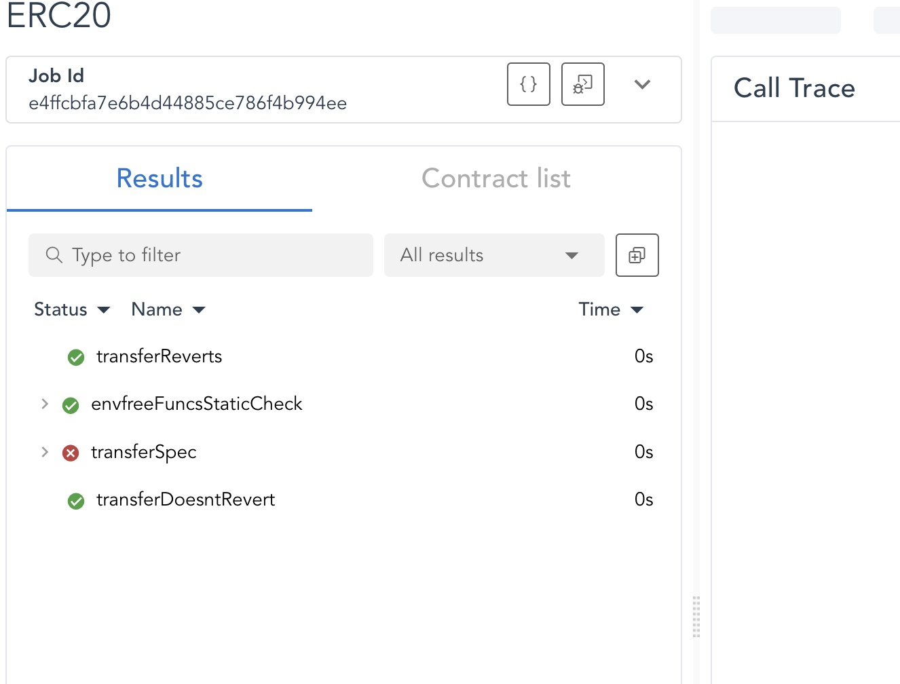
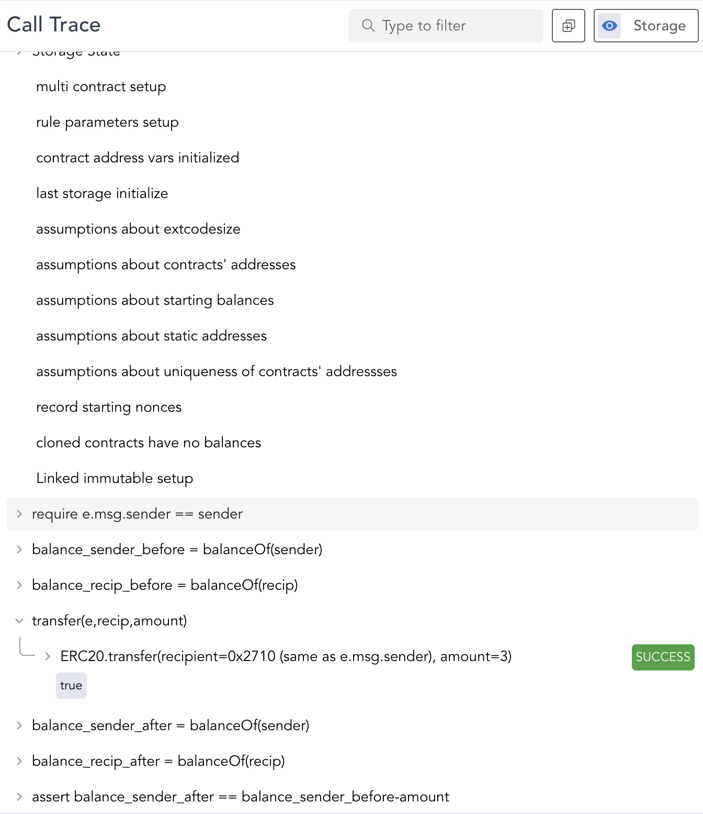

# Certora Prover - Lesson 1 


## Technology Overview 

The Certora Prover is based on well-studied techniques from the formal verification community. 
***Specifications*** define a set of rules that call into the contract under analysis and make various assertions about its behavior. 
Together with the contract under analysis, these rules are compiled to a logical formula called a ***verification condition***, which is then proved or disproved by an SMT solver. 
If the rule is disproved, the solver also provides a concrete test case demonstrating the violation.

The rules of the specification play a crucial role in the analysis. Without adequate rules, only very basic properties can be checked (e.g., no assertions in the contract itself are violated). 
To effectively use the Certora Prover, users must write rules that describe the high-level properties they wish to verify on their contracts. 
Here we will learn how to think about and write high-level properties.
</br></br>

## Example

Let's take as an example a straightforward simple [ERC20](https://ethereum.org/en/developers/docs/standards/tokens/erc-20/) implementation ([ERC20.sol](ERC20.sol)).
The contract has a mapping from users to their balance and the total supply. The primary operations are `transfer`, `mint`, `burn` and `approve`.
</br></br>
## A Basic Rule

Thinking about the function `transfer`, a basic property would be: 
  
  #### _***P1: Correct transfer functionality***: The balance of the beneficiary is increased appropriately_  

The rule transferSpec in [ERC20.spec](ERC20.spec) verifies this property. 
It verifies that the `transfer` operation decreases the balance of `msg.sender` by the transferred amount, and increases the balance of the beneficiary.  
Formal verification can provide complete coverage of the input space, giving guarantees beyond what is possible from testing alone.
All possible inputs to the transfer function (all possible recipients and all possible amounts) are taken into account.
Additionally, all possible calling contexts are considered. The Certora prover represents the calling context through the struct variable `env`. Declaring a single `env` variable suffices to capture all aspects of the calling contexts, but they can also be addressed individually.
Some example aspects of the calling context are:
 - "Who is the transfer from?" (`env.msg.sender`)
 - "In which block does the deposit occur?" (`env.block.number`)
 - "At which time does the deposit occur?" (`env.block.timestamp`)
 - (and many more)
 
> :warning: Notice that each function call must get an `env` variable as its first parameter by default:
`transfer(e, recip, amount);`.

> :bulb: It is possible to declare a function as `envfree`, meaning that it does not need get an `env` variable as a parameter since it is entirely independent of `env` context. We will see how to do it in a later lesson.

By default, the Certora prover will ignore all paths where any function call reverts, and they will not be considered violations of the rule.
We will learn more about this topic in the next lesson.

</br>

### ***Running The Tool***

To use the Certora Prover on this contract, run the following command line:

```sh
certoraRun ERC20.sol --verify ERC20:ERC20.spec --solc solc8.0
```

This command triggers a verification run on the contract `ERC20` in the solidity file `ERC20.sol`, checking all rules in the specification file. 

The command proceeds in two steps:
1. First, the solidity files are compiled with the specified solidity compiler, in this case 8.0, and the specification file is checked for syntax errors. This step happens on the local machine for fast feedback. The [`--solc` argument](https://docs.certora.com/en/latest/docs/prover/cli/options.html?highlight=--solc#options-that-control-the-solidity-compiler) is optional, Use this option to provide a path to the Solidity compiler executable file. Default is `solc` executable. You may also omit the `--solc` and use `solc-select`.e.g,
```
solc-select use 0.8.0
```  

2. Next, all necessary files are compressed and sent to Certora’s web server for verification. Verification tasks can be very heavy, so running them on the cloud can save time and resources.

To learn more about the syntax of the `certoraRun` command and its different settings, one can use the `--help` flag:

```sh
certoraRun --help
```

> :information_source: Later on, we will learn how to analyze systems containing multiple Solidity files.

> :information_source: If you are on MacOS and get an error `Bad CPU type in executable`, you can fix it by installing Rosetta. Do this by executing
`% softwareupdate --install-rosetta` in your terminal.

</br>

### ***Results***

The prover will print various information to the console. 
An email will be sent when the process is finished.
In the end, the output will look similar to this:

```
. . . 
Status page:
https://prover.certora.com/jobStatus/40726/e4ffcbfa7e6b4d44885ce786f4b994ee?anonymousKey=6d5524af6c6f55f49d49f923befa9c261c0912ba
Verification report:
https://prover.certora.com/output/40726/e4ffcbfa7e6b4d44885ce786f4b994ee?anonymousKey=6d5524af6c6f55f49d49f923befa9c261c0912ba
Full report:
https://prover.certora.com/zipOutput/40726/e4ffcbfa7e6b4d44885ce786f4b994ee?anonymousKey=6d5524af6c6f55f49d49f923befa9c261c0912ba
Finished verification request
ERROR: Prover found violations:
ERROR: [rule] transferSpec
```

Follow the "Verification results" link in the command line, or go to [prover.certora.com](https://prover.certora.com/) to see your list of jobs (the latest run will be shown on top).
You'll see a table with the verification results, similar to this image:  
For each rule, the table either displays a check mark when the rule was proved or a x-mark when a violation of the rule was discovered.

</br>

## Understanding Rule Violations

The Certora Prover helps understand violations of properties.

Click the rule name to see a counter-example violating the rule.

 

The counter-example shows values of the rule's parameters and variables and a call trace.
You can investigate the call trace to see which functions were called.
Notice the values of variables: 
* The recipient in `transfer(e, recip, amount);` is the same as the msg.sender.


So, what's the bug?  

**The rule does not hold when a user transfer to himself**

> :warning: Note that your run may present different values in the call trace because multiple sets of values may cause this violation. The prover's results are non-deterministic, i.e., the prover might choose different paths to disprove the rule each time it runs, based on various parameters.

Let's “fix” the issue in the spec and rerun the rule:

```sh 
certoraRun ERC20.sol: --verify ERC20:ERC20Fixed.spec --solc solc8.0
```

No violations were found. Great!

</br>

## Preconditions and Helper Variables

Let’s define [another property](TotalGreaterThanUser.spec) and verify that after mint, the `totalSupply` in the system is at least the balance of the beneficiary:
  
 #### _***P2: Property stems from mint***: total supply >= balance of the single user_
  
run:

```sh
certoraRun ERC20.sol --verify ERC20:TotalGreaterThanUser.spec --solc solc8.0 --rule totalSupplyAfterMint
```

> :bulb: Notice the useful flag `--rule` that allows running one rule from the entire spec file.

A violation is found. 
Do you understand why?  
Adding additional variables to the rule can help understand the counter-example. 
Try adding the ***helper variables*** `userBalanceBefore` and `totalBefore`.

As we discussed, the tool assumes all possible input values as a starting state. 
The rule is violated when the initial state's `totalSupply` is less than the current balance of `account`.
> :warning: ***Even though this contract's state is unreachable by any route of action by any user, the tool still considers this initial state as a valid state.***  </br>
This is not a mistake but a designed behavior of the Certora Prover. It's designed to over-approximate states to avoid missing paths that lead to bugs (false positives). However, doing so leads to evaluating states that might not be reachable (false negatives), as shown in this example. In the upcoming lessons we will learn how to prove that such states are never feasible, 

So how can we address this issue?

By adding ***preconditions***, one can eliminate infeasible states and put constraints on values. The Rule 
`totalSupplyAfterMintWithPrecondition` is a copy of `totalSupplyAfterMint` with an additional constraint:

```
require totalBefore >= userBalanceBefore; 
```

The prover will now assume that in the initial state, before calling `mint()`, the total supply is at least the user's balance. Run the entire spec:

```sh
certoraRun BankFixed.sol:Bank --verify Bank:TotalGreaterThanUser.spec --solc solc8.0 --msg "running with precondition"
```

> :bulb: The `--msg` flag adds a message description to your run. 
It can help you recognize a specific run.
You will see the message in the run results mail and in the job's list in [prover.certora.com](https://prover.certora.com/).

</br>

## Parametric Rules

Many property can be generalized to hold to all functions.

 #### _***P3: Verification of `approve` can change only by the holder
 
To do so, we introduce the notion of ***parametric rules***.  
To simulate the execution of all functions in the main contract, 
you can define a method variable, `method f`, as a parameter to the rule or a local variable.
The most common usage is to simulate any function on any arguments, as we show next.

```
calldataarg arg; // any argument
f(e, arg);
```

Different functions in the contract might have a different number or types of parameters. Using a `calldataarg` variable solves this problem and ensures that each simulated function gets valid input parameters.

Run the parametric rule from [parametric.spec](Parametric.spec)

```sh
certoraRun ERC20.sol --verify ERC20:Parametric.spec --solc solc8.0 --msg "parametric rule"
```

The rule would have a check mark only if it was verified on all methods. 
An inner rule is created for every function in the main contract, as shown in the lower table.
Click on the function name to see a counter-example.

Notice that this rule uncovers a bug in `decreaseAllowance`.

Parametric rules enable expressing reusable and concise correctness conditions. 
Note that they are not dependent on the implementation. 
You can integrate them easily into the CI to verify changes to the code, including signature changes, new functions, and implementation changes. 
